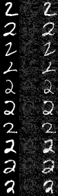

# targeted-adversarial-mnist
Adversarial attack on a CNN trained on MNIST dataset using Iterative Targeted Fast Gradient Sign Method

### Dependencies
- Tensorflow
- numpy

The `model.py` file defines the architecture and saves the trained model.

## Architecture

- Convolutional layer 1: 32 `5x5x1` kernels
- Relu activation
- Standard Max Pooling
- Convolutional layer 2: 64 `5x5x32` kernels
- Relu activation
- Standard Max Pooling
- Fully Connected Layer 1 with `1024` out units
- Relu activation
- Dropout
- Fully Connected Layer 2 with `10` out units (representing 10 classes of the dataset)

The `adversary.py` file creates the adversarial examples.  It takes 2 arguments
- `--input_class` or `-i`
- `--target_class` or `-t`

Input class is the actual label of the input image.

Target class is the label that we want the network to predict for the input image

The image is modified by taking the gradient of the cost function w.r.t the input.

The pre-trained model is present in the `model` folder. So, the adversary script can be run directly.

`python adversary.py -i 2 -t 6`

The default parameters are: `EPSILON=0.01` and `SAMPLE_SIZE=10`.

## Result

### TO-DO
- ~~Refactor~~
- One pixel attack with Differential Evolution
- Momentum

# References
- [karpathy's blog](http://karpathy.github.io/2015/03/30/breaking-convnets/)
- [One pixel attack](https://arxiv.org/abs/1710.08864)
- [Boosting Adversarial Attacks with Momentum](https://arxiv.org/pdf/1710.06081.pdf)
